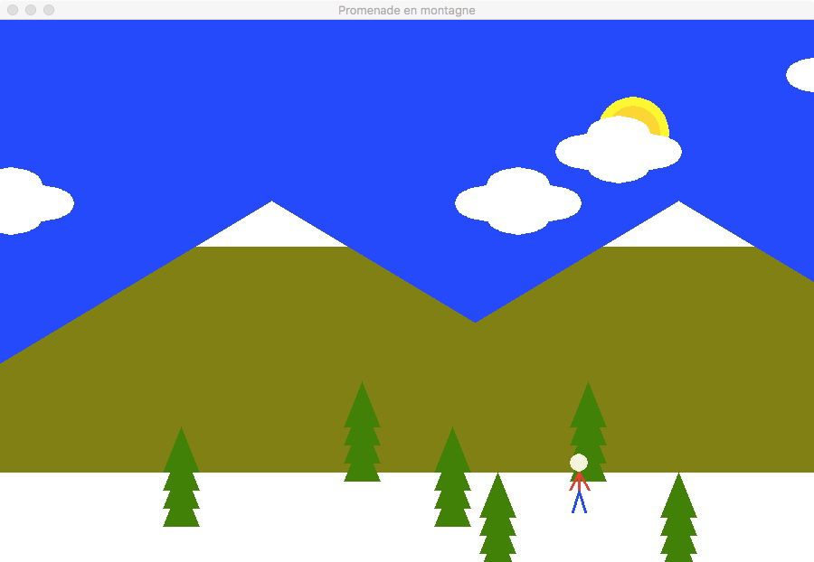

# TP7 Figure

Aujourd’hui, vous allez créer une animation en Python avec Pygame. L’objectif est pratiquer l’uti-
lisation des modules et des fonctions graphiques. Voici une photo de l’animation que vous allez créer.

En effet, vous devez réaliser une animation qui ressemble à peu prêt celle ci, mais vous n’êtes pas
obligé de la faire au pixel prêt! Si vos nuages sont un peu plus grandes, votre soleil n’est pas exacte-
ment au même endroit, ou bien les montagnes n’ont pas toute à fait de la même couleur, ce n’est pas
grave! L’important est de programmer une animation qui ressemble celle si en respectant les quelques
restrictions imposées.

``Rappelez-vous! Dans les salles TP, Pygame fonctionne uniquement avec :``
``Python 2.7``

Pour réaliser cette animation, vous devez utiliser les fonctions **pygame.draw.rect**,**pygame.draw.circle**,
**pygame.draw.polygon**, etc. de Pygame. Vous pouvez consulter la documentation de la bibliothèque
Pygame (en anglais) :  
	[http://www.pygame.org/docs/ref/draw.html](http://www.pygame.org/docs/ref/draw.html)  
Par ailleurs, n’oubliez pas de faire la documentation de vos fonctions.

## 1 Le module principal

Pour pouvoir tester votre animation au fur et à mesure de ça création, vous devez commencer par
le module principal du programme. La première chose à faire est donc de créer un dossier appelé **tp07**
 et à l’intérieur de ce dossier vous devez créer le fichier *__main__.py*. Ce fichier constitue le module
principal du programme.

### 1.1 La fonction principale

Dans le module principal, écrivez la fonction *main* qui ne reçoit pas d’argument et n’a pas de valeur
de retour. Cette fonction doit :  

1. Initialiser Pygame.
2. Ouvrir la fenêtre de l’application et l’attribuer le titre «Promenade en montagne».
3. Initialiser l’horloge.
4. Tant que le programme n’est pas terminé :
    (a) Traiter l’événement *pygame.QUIT*  
	(b) Effacer la surface de l’application.  
	(c) Mettre à jour la surface de l’application.  
	(d) Ajuster la vitesse de la boucle.  
5. Terminer Pygame.

### 1.2 Appel à la fonction principale

Ajoutez l’appel à votre fonction principale dans le module principal.  
Testez votre programme maintenant et vérifiez que la fenêtre de l’application s’ouvre. À ce stade,
elle est encore vide.

## 2 Module couleur

Vous devez créer un *modulecouleur.py* dans le dossier *tp07*. Définissez toutes les couleurs utilisées dans le scénario dans ce module. Comme dit auparavant, le dessin que vous allez créer doit ressembler celui ci-dessus. Néanmoins, ne perdiez pas trop de temps pour trouver les couleurs exactes. Vous
n’êtes pas obligé d’utiliser exactement les mêmes couleurs dans votre figure.  
Pour trouver le code RVB des couleurs dont vous aurez besoin dans votre animation, consultez la
liste de couleurs sur wikipedia :  
    [http://fr.wikipedia.org/wiki/Liste_de_noms_de_couleur](http://fr.wikipedia.org/wiki/Liste_de_noms_de_couleur)

## 3 Module scénario

Vous devez créer un *modulescenario.py* dans le dossier *tp07*. Vous allez créer (par la suite) les
fonctions qu’initialise, met à jour et dessine le scénario dans ce module.

### 3.1 Initialisation

Écrivez la fonction *init* qui ne reçoit pas d’arguments et retourne un dictionnaire. La fonction doit
initialiser le dictionnaire des attributsattdu scénario et le retourner. Cette fonction sert à initialiser le
scénario, c’est-à-dire, les nuages et le personnage (l’homme-bâton). Mais nous allons faire cela plus tard
dans le TP. Pour l’instant, la fonction doit uniquement retourner un dictionnaire *att vide*.  
	Importez le module scénario dans le module principal (__main__.py) :  
import scenario  
	Ajoutez l’instruction :  
scen = scenario.init()  
dans la fonction principalemaindu module principal du programme. Placez cette instruction avant la
boucle principale du programme.

### 3.2 Dessin

Écrivez la fonction *dessine* qui reçoit les attributs d’un scénario *scenario* et aussi *surface* en
argument. Cette fonction fera appel aux fonctions définies ci-dessous pour dessiner le scénario.  
	Ajoutez l’instruction :  
		*scenario.dessine(scen, surface)*  
dans la fonction principal *main* du module principal du programme, où *scen* est le scénario initialisé
plus tôt et *surf* correspond à la surface de l’application. Placez cette instruction dans la boucle principale
juste avant la mise à jour de la surface de l’application.  
La fonction *dessine* est donc responsable pour dessiner tout le scénario, y compris les nuages
et le personnage. Au fur et à mesure que vous créez les autres fonctions de dessin (*dessine_ciel*,
*dessine_montagne*, etc.) ajoutez ses appels dans la fonction *dessine* et testez votre programme.

### 3.3 Le ciel

Nous allons maintenant commencer à dessiner. Écrivez la fonction *dessine_ciel* qui reçoit *surface*
en argument. La fonction doit dessiner le ciel du scénario (sans les nuages).  
Ajoutez l’appel à à cette fonction dans la fonction *dessine* et testez votre programme.

### 3.4 Le soleil

Écrivez une fonction *dessine_soleil* qui reçoit *surface* argument. La fonction doit dessiner le
soleil.  
Ajoutez l’appel à cette fonction dans la fonction *dessine* et testez votre programme.

### 3.5 Les montagnes

Écrivez une fonction *dessine_montagnes* qui reçoit *surface* argument. La fonction doit dessiner
les montagnes.  
Ajoutez l’appel à cette fonction dans la fonction *dessine* et testez votre programme.

### 3.6 Le sol

Écrivez une fonction *dessine_sol* qui reçoit *surface* argument. La fonction doit dessiner le sol.
Ajoutez l’appel à cette fonction dans la fonction *dessine* et testez votre programme.

### 3.7 Les arbres

Écrivez une fonction *dessine_arbre* qui reçoit un tuple de deux entiers (x, y) et *surface* en
arguments. La fonction doit dessiner un seul arbre dans la position passée en argument.  
**Piste**: les arbres sont dessinés en utilisant plusieurs triangles. Pour pouvoir dessiner un triangle à la
position(x, y)vous devez utiliser la technique du «décalage». Par exemple, au lieu de faire :  
pygame.draw.polygon(surface, VERT, ((0, 50), (20, 0), (40, 50)))  
Vous pouvez faire :  
pygame.draw.polygon(surface, VERT, ((x+0, y+50), (x+20, y+0), (x+40, y+50))).  
Et pour dessiner 4 triangles, vous pouvez faire un *for i in range(4)* et utiliser la variable *i* pour
calculer la position de chaque triangle.
Ajoutez plusieurs appels à cette fonction dans la fonction *dessine*. Variez les positions des arbres
pour créer l’impression d’un petit bois. Testez votre programme.

### 3.8 Mise à jour

Il s’agit de la fonction qui sert à mettre à jour le scénario. C’est à dire, elle fera appel à d’autres fonc-
tions pour changer les positions des nuages et du personnage. Pour l’instant, cette fonction contiendra
uniquement l’instruction : *pass*. En d’autres mots, pour l’instant, elle ne fait rien.  
Ajoutez l’appel à cette fonction dans la boucle du programme principal. L’instruction *scenario.update()*
doit être placée juste avant l’appel à dessine.

## 4 Module nuages

Créez un module *nuages.py* dans le dossier *tp07*. Ainsi comme le module scénario, le module
nuages contiendra les fonctions *init*,*dessine* et *update*.  
La programmation des nuages est très semblable à celle de la neige vue en cours. Mais au lieu de
bouger du haut vers le bas, les nuages bougent de la gauche vers la droite de l’écran.

### 4.1 Initialisation

Cette fonction reçoit un entier *nombre* en argument et retourne un dictionnaire contenant les attributs
des nuages. La fonction doit donc créer un dictionnaireattcontenant les attributs des nuages listés ci-
dessous :  
	—vit: la vitesse de déplacement d’un nuage (tous les nuages se déplacent à la même vitesse).  
	—lim: les coordonnées(x, y)limites pour un nuage à l’écran (après lesquelles les nuages disparaissent de l’écran).  
	—objs: une liste contenantnombretuples de deux entiers(x, y), chacun correspondant à la position d’un nuage à l’écran.  
Pour créer la liste des nuages (objs), utilisez une boucle et initialisez leurs positions aléatoirement
à l’écran. Retournez le dictionnaire avec les attributs.
Importez le module nuages dans le module scénario :
*import nuages*
   Ajoutez l’appel à la fonction *init* que vous venez de créer dans la fonction *init* du module
*scenario* de façon à ajouter les attributs de nuages aux attributs du scénario : Par exemple, ajoutez :  
*att[’nuages’] = nuages.init(4)*  
pour ajouter 4 nuages au scénario.

### 4.2 Dessin

Écrivez la fonction *dessine* qui reçoit les attributs des nuages *att* et *surface* en arguments. La
fonction doit dessiner tous les nuages à leur positions respectives sur l’écran.  
**Piste** :Les nuages sont dessinées avec des ellipses.  
Ajoutez l’appel à la fonction *nuage.dessine* dans la fonction *dessine* du module *scenario* pour
dessiner les nuages.  
**Piste** :Si les nuages sont dessinés avant les montagnes ces dernières apparaissent devant les nuages
et vice-versa.  
Testez votre programme (les nuages s’affichent, mais ne se déplacent pas encore).

### 4.3 Mise à jour

Écrivez la fonction *update* qui reçoit les attributs des nuages *att* en argument. La fonction doit faire
bouger les nuages. C’est-à-dire, pour chaque nuages de la liste des nuages *(att[’objs’])* changez sa
position en ajoutant sa vitesse *att[’vit’]*. Si la position dépasse la limite *(att[’lim’])*, alors recréez
un nuage aléatoirement à l’autre bout de l’écran.  
**Piste** :Jetez un oeil sur le programme de la neige.  
Ajoutez l’instruction :  
nuages.update(att[’nuages’])  
dans la fonctionupdatedu modulescénariopour mettre à jour les nuages.  
Testez votre programme. Vos nuages doivent bouger maintenant.

## 5 Le personnage

Créez le module *perso.py* dans le dossier *tp07*. Encore une fois, nous allons créer un module avec
les fonctions *init*, *dessine* et *update*.

### 5.1 Initialisation

Écrivez une fonction *init* qui reçoit un tuple de deux entiers(x, y)en argument. La fonction doit
initialiser le dictionnaire *att* des attributs du personnage et ensuite le retourner. Le dictionnaire doit
contenir les champs suivants :  
	— pos: un tuple de deux entiers contenant la position du personnage. Ceci est égal à la position
passée en argument.  
	— lim: un entier contenant la position limite du personnage à l’écran. C’est à dire, le moment où il
arrêtera de marcher vers la gauche et marchera vers la droite. Ceci est égal à la largeur de l’écran
moins la largeur du dessin de l’homme-bâton.  
	— vit: un entier contenant la vitesse de déplacement du personnage.  
	— img: un entier entre 0 et 2. Ceci représente l’image actuel du personnage. Si cet attribut est égal
à 0, vous allez dessiner l’homme-bâton avec les jambes ouvertes, s’il est égal à 1, dessiner avec
les jambes demi-ouvertes, s’il est égal à 2 dessiner avec les jambes fermées.  
Ajoutez les instructions nécessaires pour ajouter un personnage au scénario.

### 5.2 Dessin

Écrivez la fonction *dessine* qui reçoit une surface et **un tuple** de deux entiers(x, y)en argument. La fonction doit dessiner l’homme-bâton qui correspond à l’image actuel du personnage (attribut att[’img’]).

**Piste** : Vous pouvez créer une fonction différente pour chaque position des jambes de l’homme-bâton. Vous appellerez ici la fonction qui correspond selon la valeur de l’attribut *img*.    
Ajoutez les instruction nécessaires pour dessiner le personnage en même temps que les autres éléments du scénario.  
**Piste** :Ainsi que pour les nuages, si vous dessinez le personnage avant un arbre il apparaitra derrière
cet arbre et vice-versa.  
Testez votre programme maintenant. Il doit dessiner le personnage, mais ceci ne bouge pas encore.

### 5.3 Mise à jour

Écrivez une fonction *update* qui reçoit un dictionnaire d’attributs d’un personnage comme argument. La fonction doit réaliser les trois opérations suivantes :

1. Mettre à jour l’image du personnage. C’est à dire, l’attribut *img* doit être incrémenté, ou bien
    revenir à 0 dans le cas où il a dépassé sa valeur maximale 2.  
2. Mettre à jour la position du personnage. C’est à dire, l’attribut *pos* doit être incrémenté de la
    valeur de l’attribut *vit*.  
3. Rebondir sur le bord de l’écran si nécessaire. C’est à dire, vérifier si le personnage a dépassé la
    limite de l’écran (c.à.d. : vérifier la valeur de l’attribut *pos* par rapport à *lim*). Auquel cas, la
    vitesse doit être multipliée par−1.  
Ajoutez les instructions nécessaires pour mettre à jour le personnage en même temps que les autres
éléments du scénario.  
Testez votre programme maintenant. Il doit être prêt.