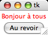
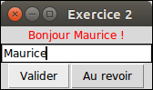
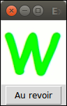
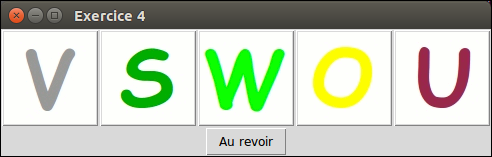
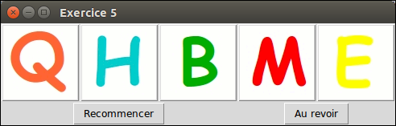
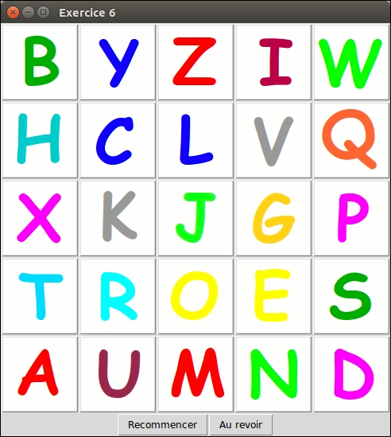

# TP 4 Interface Graphique

## Exercice 1

Ecrire une classe *VueMessage* qui créé une fenêtre graphique avec un message de
bienvenue et un bouton pour quitter l’application. Votre application doit donc contenir une étiquette (Label), et un bouton. Un message de bienvenue est proposé par défaut, mais il peut être donné en paramètre du constructeur de *VueMessage*.



## Exercice 2

On complique l’application précédente : on veut maintenant dire bonjour à la personne
qui aura donné son nom.


1. Créez la classe *VueMessage2* qui construit une fenêtre avec chacun des composants graphiques élémentaires nécessaires : une étiquette, une zone de saisie (Entry), deux boutons
2. Améliorez l’organisation du placement pour que les deux boutons soient côte à côte.
3. Spécifiez puis écrivez la méthode *valider* qui change le message de bienvenue en fonction du nom saisi par l’utilisateur. Quels sont les composants auxquels vous avez besoin d’accéder dans cette méthode ? Modifiez votre constructeur afin que ces composants soient mémorisés chacun dans un attribut.
4. Associez la méthode valider à un clic sur le bouton valider.
5. N’oubliez pas de lancer la boucle d’écoute des événements à la fin de votre constructeur

## Exercice 3

On veut maintenant afficher une lettre de l’alphabet au hasard. Téléchargez à partir de
Moodle les images nécessaires pour ce TP.  
Le module *string* vous fournit *ascii_lowercase* qui est une chaîne de caractères qui contient toutes les lettres de l’alphabet.
```
>>> import string
>>> string.ascii_lowercase
’abcdefghijklmnopqrstuvwxyz’
```

Vous devez stocker les images de l’alphabet (*PhotoImage*) dans une liste. Vous devrez spécifier et écrire une fonction *initialisationImages* qui effectue cette initialisation. Cette fonction sera appelé dans le constructeur de la classe *VueAlphabet* que vous devez écrire pour cette application.  
Attention : cette fonction sera appelée après avoir créé une fenêtre Tk().



## Exercice 4

On veut maintenant afficher cinq lettres, tirées aléatoirement parmi les lettres de l’alphabet. Elles sont affichées sur 5 boutons alignés.



## Exercice 5

On reprend l’exercice précédent mais on peut rejouer et ré-afficher aléatoirement les
images. Pour que ce soit plus joli, on ne prendra pas en compte l’image blanche (qui sera stockée à l’indice zéro de votre liste d’images), et on vérifiera qu’on n’affiche pas ensemble deux boutons avec la même lettre.



## Exercice 6

Reprenez l’exercice précédent, mais avec un affichage des images qui se fait sur 5 lignes
et 5 colonnes.

