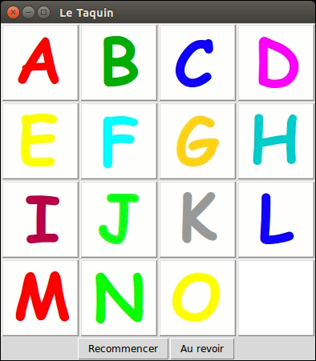

# TP 5 Le Taquin

L’objectif de ce TP est de construire un jeu de taquin selon le schéma Modèle-Vue-Contrôleur.

## Exercice 1 : Le modèle

Vous pouvez soit ré-Implémenter la classe *Taquin*, que nous avons vue en
cours, dans un module taquin.py, soit récupérer le source du taquin qui est mis à disposition sur Moodle. On rappelle que la classe *Taquin* possède les méthodes suivantes :

- un constructeur (les valeurs du plateau sont placées dans l’ordre, le vide est dans la dernière cellule)
- une méthode *bouge_case(self,val)* qui permute le contenu de la case qui contient la valeur *val* et le contenu de la case qui contient le vide. Cette méthode retournera toujours vrai.  
Ainsi, quelque soit la case sélectionnée, *bouge_case* échange le vide et val
- une méthode *coords_vide(self)* qui retourne les coordonnées du vide
- une méthode *partie_finie(self)* qui détecte si la partie est finie
- une méthode *reinit(self)* qui réinitialise les valeurs du plateau (les range dans l’ordre comme au début)

Ajoutez à cette classe les méthodes suivantes :
- une méthode *dim(self)* qui retourne la dimension du taquin
- une méthode *get(self,lig,col)* qui retourne la valeur du plateau en position *(lig,col)*

## Exercice 2 : La Vue

Implémentez la classe VueTaquin, inspirée de l’exercice 6 du TP précédent, dans un module *guitaquin.py* (gui : graphical user interface. La classe *VueTaquin* doit posséder :
- un constructeur qui prend une instance d’un *Taquin* en paramètre. Une interface graphique doit être construite de telle sorte :
	- qu’elle affiche *dim x dim* images placées sur des boutons (*dim* étant la dimension du *Taquin*)
	- qu’elle conserve dans une liste les images des lettres de l’alphabet (le premier élément de la liste, à l’indice 0, doit être l’image du vide)
	- que les images affichées sur le plateau correspondent aux valeurs sur le plateau du *Taquin*
	- qu’il y ait un bouton pour quitter le jeu et un bouton pour recommencer une partie.
- Seul le bouton pour quitter l’application sera associé à une action dans un premier temps.
- le modèle (l’instance du *Taquin*), la liste des boutons qui affichent les images, la liste des images seront conservés dans des attributs.

## Exercice 3 : Le contrôleur de *bouge_case* (1).

Nous allons écrire une première version du contrôleur qui gère l’événement l’utilisateur a cliqué sur une image. Chaque bouton qui affiche une lettre doit être associé à ce contrôleur. C’est une méthode ctrl choisit *case(self)* de *VueTaquin*, qui choisit
aléatoirement une case du plateau, et demande au modèle de bouger cette case. La vue se met ensuite à jour.  
Dans le dessin ci-dessus, cela pourrait conduire au fonctionnement suivant : l’utilisateur clique sur la case E, c’est la case M qui est choisie aléatoirement et permutée avec le vide.  
Spécifiez puis écrivez la méthode *ctrl_choisit_case(self)*.

## Exercice 4 : Le contrôleur de réinitialisation.

 Spécifiez puis écrivez la méthode *ctrl_reinit(self)* qui est associée au bouton *Recommencer*. Cette méthode demande au modèle de se réinitialiser puis demande
à la vue de se remettre complàtement à jour.  
Vous aurez peut-être une nouvelle méthode dans VueTaquin à écrire pour cette fonctionnalité, et ainsi envisager le lancement de l’application d’une manière différente. Vous vous poserez ces questions lorsqu’une première version fonctionnera, pour éviter la redondance de code.

## Exercice 5 : Le contrôleur de bouge case (2).

Spécifiez puis écrivez la méthode creer *ctrl_choisit_case(self,lig,col)* qui retourne une fonction. La fonction retournée (que vous devrez spécifier) s’appelle *ctrl_choisit case()* et demande au modèle de permuter la case *(lig,col)* avec le vide. Si la permutation a pu avoir lieu, alors la fonction demande à la vue de se
mettre à jour. Vous pouvez supprimer (ou commenter) votre version précédente de *ctrl_choisit_case(self)*.

## Exercice 6 : 

Vous devez maintenant détecter la fin de partie. Si la partie est finie, les boutons qui
contiennent les images doivent être inactifs tant que la joueur n’a pas recommencé une partie.

## Exercice 7 : 

Si vous ne l’avez pas déjà fait, implémentez dans un module *txttaquin.py* une fonction
*main()* qui permet de jouer au taquin dans un mode texte.
2